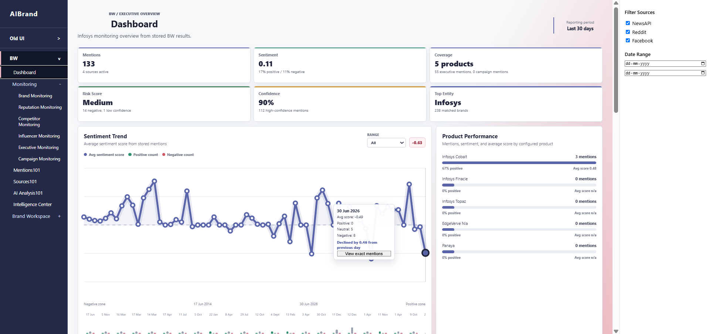
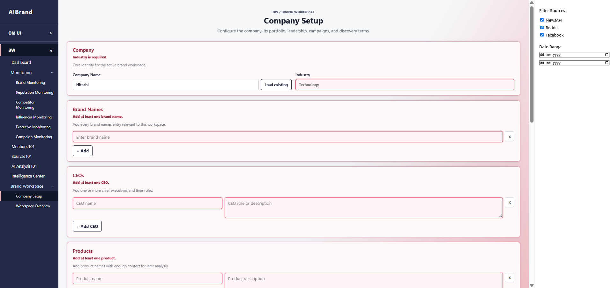
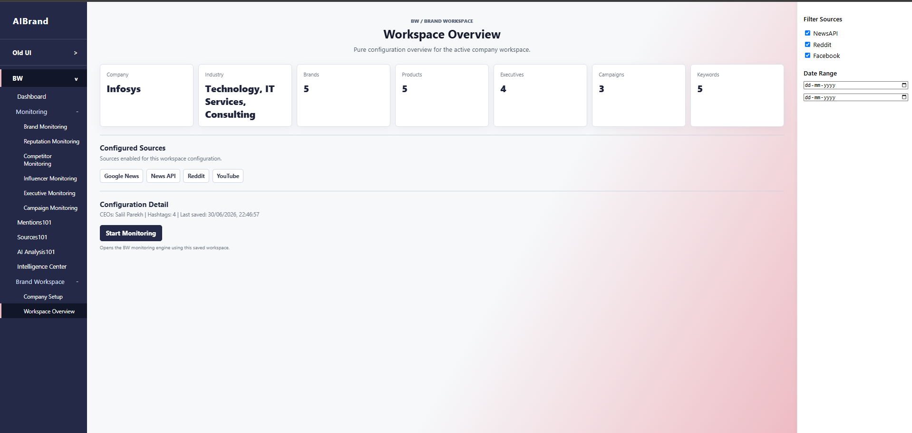
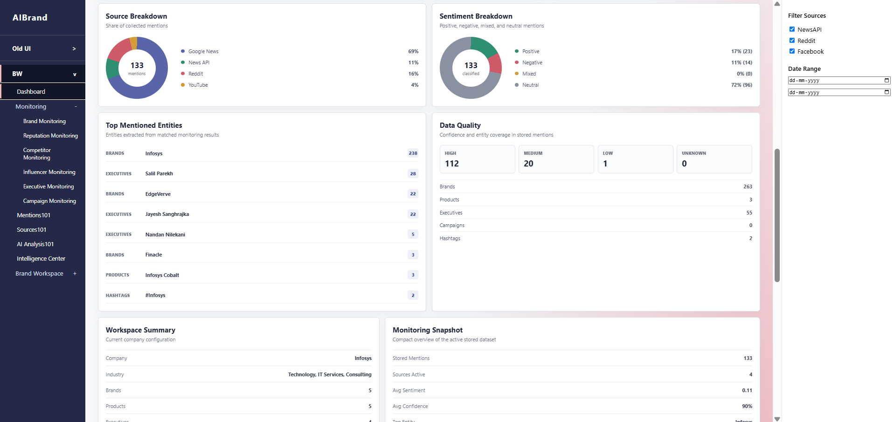
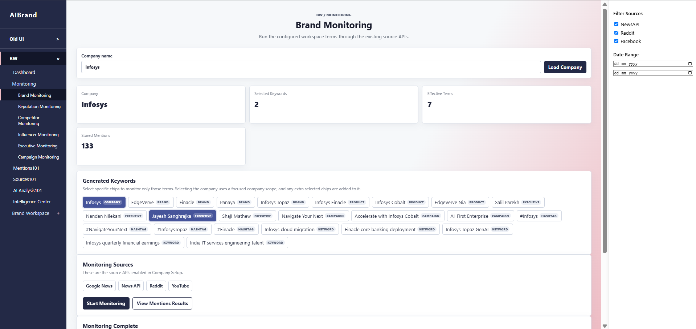
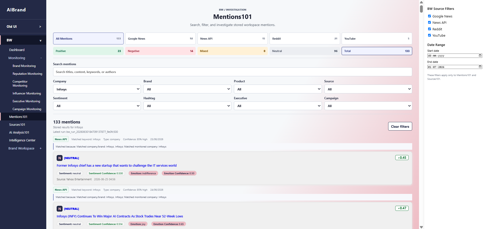
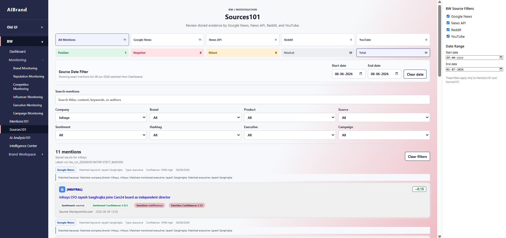
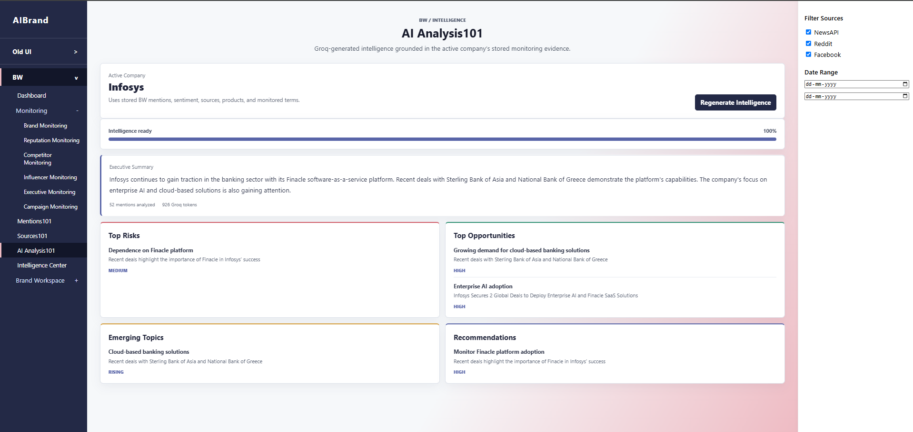
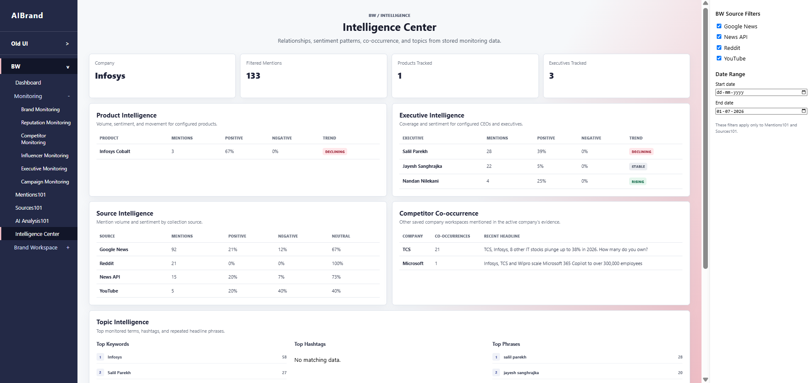
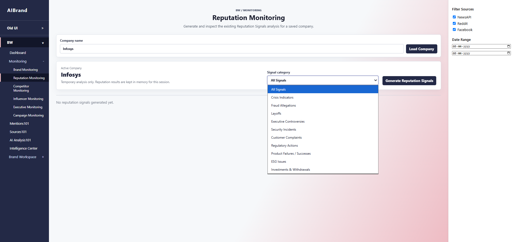

# AIBrand – Brand Workspace

## Overview

Brand Workspace (BW) is an AI-powered brand monitoring platform that helps organizations understand how they are being discussed across multiple online sources.

A company first configures its profile (company, brands, products, executives, campaigns, hashtags, keywords, and monitoring sources). The system then continuously collects public mentions, identifies which content actually belongs to that company, analyzes sentiment and reputation, and presents actionable insights through an interactive dashboard.

The long-term vision is to provide a complete Brand Intelligence platform where organizations can:

- Monitor their own brand presence
- Track reputation and public perception
- Understand product and executive visibility
- Discover emerging risks and opportunities
- Compare themselves with competitors (future implementation)
- Generate AI-powered business insights for decision making

<p align="center">

</p>

---

# How the System Works

```text
Company Setup
      │
      ▼
Workspace Configuration Saved
      │
      ▼
Keyword Generation
      │
      ▼
Collect Data
(Google News, NewsAPI, Reddit, YouTube)
      │
      ▼
Entity Validation & Matching
      │
      ▼
Sentiment + AI Analysis
      │
      ▼
Store Results (CSV Repository)
      │
      ▼
Dashboard & Investigation Pages
```

---

# Workflow

## 1. Company Setup

Configure:
- Company
- Brands
- Products
- CEOs
- Executives
- Campaigns
- Hashtags
- Keywords
- Monitoring Sources

<p align="center">

</p>

<p align="center">

</p>

## 2. Keyword Generation

The monitoring engine automatically creates search terms from the saved workspace. Users may monitor the whole company or only selected keywords.

## 3. Data Collection

Sources:
- Google News
- NewsAPI
- Reddit
- YouTube

## 4. Entity Validation

The platform validates mentions using:

- GLiNER (Named Entity Recognition)
- Keyword & alias matching
- Company-aware validation
- Confidence scoring
- Duplicate detection

Only relevant mentions are stored.

## 5. AI Analysis

Each validated mention undergoes:

- Sentiment Analysis
- Emotion Detection
- Entity Extraction
- Reputation Signal Analysis

Groq LLM generates:

- Executive Summary
- Risks
- Opportunities
- Recommendations
- Emerging Topics

## 6. Storage

Instead of using a relational database, the current implementation stores data in structured CSV files.

This approach was chosen to simplify development, testing and demonstration of the complete monitoring pipeline.

For production deployment, the storage layer will be migrated to **PostgreSQL** for persistent storage, scalability and multi-user support.

Stored CSV files:

- companies.csv
- products.csv
- executives.csv
- campaigns.csv
- hashtags.csv
- mentions.csv

Every monitoring run receives a unique **Run ID**, allowing stored mentions to be retrieved later without rerunning monitoring.

---

# Main Features

## Dashboard

Provides:
- Mention statistics
- Sentiment analytics
- Product performance
- Source distribution
- Recent mentions
- Workspace summary

<p align="center">

</p>

<p align="center">

</p>

---

## Brand Monitoring

Runs the monitoring pipeline using the configured workspace.

<p align="center">

</p>

---

## Mentions101

Search and investigate stored mentions.

<p align="center">

</p>

---

## Sources101

Review evidence grouped by source.

<p align="center">

</p>

---

## AI Analysis101

AI-generated intelligence from stored monitoring data.

<p align="center">

</p>

---

## Intelligence Center

Aggregated insights across products, executives, topics and sources.

<p align="center">

</p>

---

# AI Models & Technologies

- GLiNER
- Groq LLM
- Rule-based entity validation
- Confidence scoring
- Sentiment analysis
- Emotion analysis
- Duplicate detection

---

# Current Implementation Status

## ✅ Fully Implemented

- Company Workspace
- Keyword generation
- Multi-source monitoring
- Entity validation
- CSV repository
- Dashboard
- Brand Monitoring
- Mentions101
- Sources101
- AI Analysis101
- Intelligence Center
- Reputation Signals

<p align="center">

</p>

## 🚧 Planned

- Competitor Monitoring
- Executive Monitoring
- Campaign Monitoring
- Influencer Monitoring
- PostgreSQL migration
- Scheduled monitoring
- Real-time alerts

---

# Future Vision

Brand Workspace is being developed into a complete Brand Intelligence Platform that enables organizations to monitor their digital presence, understand reputation, generate AI-powered insights, and eventually benchmark themselves against competitors for strategic decision-making.
